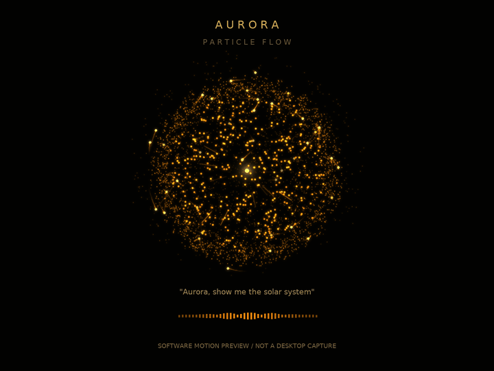
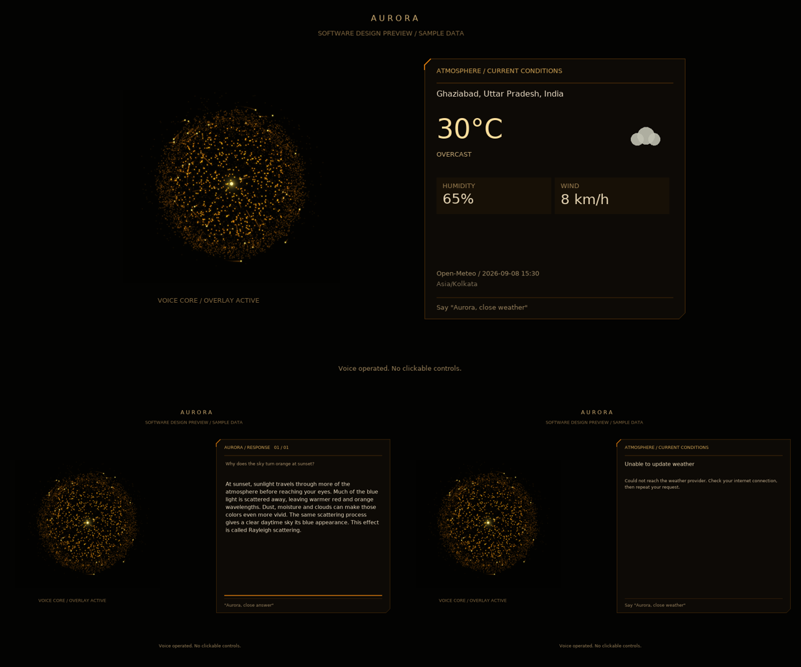

# Aurora AI

A local Python desktop assistant with a holographic OpenGL dashboard,
webcam hand gestures, optional voice AI, and opt-in local face enrollment.
The dashboard runs in **a desktop window**, not a browser.

## Install

Use Python 3.11 or 3.12 and a virtual environment:

```sh
python -m venv .venv
# Windows:
.venv\Scripts\activate
# macOS / Linux:
source .venv/bin/activate
pip install -r requirements.txt
```

Linux additionally needs desktop OpenGL and PortAudio libraries. On Debian/Ubuntu:

```sh
sudo apt install libgl1 libglu1-mesa portaudio19-dev python3-dev
```

PyAudio requires a compatible wheel or PortAudio development headers.
`pycaw` and `comtypes` are installed only on Windows; system volume/media
integration is Windows-specific. Don't install multiple OpenCV variants in
the same environment; this project uses `opencv-contrib-python` for LBPH.

## Run

```sh
python main.py
```

Starts in a normal **960×640 window**, reduced to leave desktop/taskbar space.
Fullscreen and F11 switching are disabled unless you explicitly pass `--fullscreen`.
The title bar identifies this build as **Amber Core | amber-flow-v4**.
Camera and voice are attempted; unavailable camera or voice
setup is reported in the dashboard event log. Missing core dependencies are
reported in the terminal with a nonzero exit code.

```sh
python main.py --no-camera --no-voice  # visual-only troubleshooting
python main.py --windowed             # explicitly lock normal-window mode
python main.py --diagnose             # identify the code this folder will launch
python main.py --fullscreen           # opt in to fullscreen and F11 switching
python main.py --debug-camera         # optional webcam preview window
python main.py --camera-index 1       # choose another camera
python main.py --help
```

## Project layout

```text
Aurora-AI/
├── main.py                  # entry point
├── jarvis_ui/
│   ├── __init__.py
│   ├── paths.py             # shared project-root paths
│   ├── hologram.py          # OpenGL dashboard and interaction
│   ├── particle_core.py     # deterministic amber-core animation
│   ├── overlays.py          # responsive overlay layout
│   ├── display_bridge.py    # main-thread command dispatch
│   ├── timers.py            # cancellable timer service
│   ├── hand_tracker.py
│   ├── voice_assistant.py
│   ├── weather.py           # structured Open-Meteo client
│   ├── face_id.py
│   ├── system_control.py
│   └── phone_control.py
├── hand_landmarker.task
├── requirements.txt
└── tests/
```

Run `main.py`, not the individual package modules. Keys, model, device
configuration, logs, snapshots, and face data remain at the **project root**.
Paths do not depend on your terminal's current working directory.

## Dashboard controls

| Key | Action |
| --- | --- |
| `1` | Demo hologram |
| `2` | Carbon atom |
| `3` | Solar system |
| `Tab` | Cycle color theme |
| `R` | Reset zoom, pan and roll |
| `F11` | Toggle fullscreen only when launched with `--fullscreen` |
| `H` | Toggle help overlay |
| `Esc` | Close help first, otherwise exit |
| `q` in webcam preview | Exit when `--debug-camera` is enabled |

### Voice-first HUD

No clickable buttons, toolbar, hover targets, or mouse navigation. Inspired by
the supplied amber-core reference, the default view is almost black with a
**glowing gold particle sphere** built from moving three-dimensional positions.
In balanced mode it contains 3,460 particles, including 40 bright relay heads with short fading
trails. Near particles appear brighter/larger; far particles recede. Orbit planes
precess, nearby relays briefly connect, and light packets move outward instead
of forming fixed center-to-edge spokes. There are no complete decorative orbit
circles in the core. In balanced mode, seven vertex-array batches draw the particles and trails,
plus a few small nucleus/glow draws. The seeded model does not accumulate history.

The app generates particle motion every frame; it does **not** load the preview
image/GIF or play a canned animation. It uses perspective projection and additive
particle lighting, **not hardware ray tracing**. Motion uses elapsed time rather
than frame count, and the particles follow different paths rather than rotating
a single flat image.

### Particle quality and motion

- **Balanced (default):** 3,460 points and 40 relay trails.
- **Performance:** 1,230 points, 20 shorter trails, less glow work. Say
  “Aurora, performance mode” if your laptop struggles.
- **Cinematic:** 5,460 points, finer trails and an additional wide glow pass.
  Say “Aurora, cinematic mode” when you have processing headroom.
- “Aurora, balanced graphics” restores the default without rebuilding the scene.

You can also choose at launch:

```sh
python main.py --windowed --graphics performance
python main.py --windowed --graphics cinematic
```

Voice energy/color changes are eased rather than snapped. “Reduce motion” holds
the current particle pose; “resume animation” continues from there instead of
jumping to a different frame. Quality changes retain shared particle positions.
All quality levels remain procedural, not video/image playback. Actual frame
rate still depends on camera workload and your graphics driver.

The core stays amber through listening/thinking/speaking; warmth and energy
change instead of switching the whole screen to cyan. The bottom signal animation
reflects assistant state, **not measured microphone amplitude**. The HUD labels
voice as offline if it cannot start. Grid, corner frames, and large telemetry
panels are hidden by default. Weather docks beside the core; existing atoms,
shapes, and solar-system displays remain available.



This is a **software design preview**, produced from the same particle geometry,
not a captured OpenGL window. Glow/point rasterization may differ on your GPU.
To regenerate it (optional development dependency):

```sh
pip install Pillow
python tools/render_core_preview.py --motion
```

Say **“Aurora”** and your request together, or say the wake word alone and then
speak during the five-second follow-up listening window.

- “Aurora, show me a carbon atom.”
- “Aurora, show me the solar system.”
- “Aurora, change theme.”
- “Aurora, show core.” — return from a diagram to the particle sphere.
- “Aurora, show diagnostics.” / “Aurora, hide diagnostics.”
- “Aurora, reduce motion.” / “Aurora, resume animation.” — freeze/resume the particle core.
- “Aurora, show help.” / “Aurora, close help.”
- “Aurora, read more.” / “Aurora, scroll up.” — navigate long answers.

### Refined overlays and function checks

Weather, answers and the guide use consistent charcoal/amber cards. Wide windows
dock cards beside the core; smaller windows center them without squeezing text
against the particle sphere. Weather includes separate humidity/wind readouts,
loading/error states, source and update time. Answers have numbered pages and a
progress indicator; “read more” advances by the visible page size. “Close answer”
returns to the core. The core eases into its docked position.



Voice display/face-data operations are dispatched between frames on the main
thread. Timer cancellation now cancels the underlying callback; speech notices
are queued so greetings and timer notifications do not block rendering. Text
rasterization uses a bounded cache that survives fullscreen context changes.
See [validation and local smoke tests](docs/VALIDATION.md) for the tested scope
and checks that still need your hardware.

Keyboard shortcuts above remain as troubleshooting fallbacks, not on-screen
buttons. Optional diagnostics (also toggled with F3) appear only on larger windows. Rendering is capped
at 60 FPS; unsupported multisampling is retried without MSAA.

### Weather

Weather uses Open-Meteo geocoding and current-condition JSON, **not an LLM's
formatted answer**. It does not need a Groq key (speech recognition still needs
internet access). Try:

- “Aurora, weather in Ghaziabad.”
- “Aurora, what's the weather like in Delhi today?”
- “Aurora, close the weather.”

No city is silently guessed. For “weather here” or a request without a city,
optionally configure a default before starting:

```powershell
# Windows PowerShell
$env:AURORA_WEATHER_CITY = "Ghaziabad"
python main.py
```

```sh
# macOS / Linux
AURORA_WEATHER_CITY="Ghaziabad" python main.py
```

Without a configured default, Aurora asks you to repeat the request with a city.
Ambiguous names use the provider's ranked result, whose resolved location is
shown and spoken; use a city and country (e.g. “Paris, France”) to qualify it.
Temperature is Celsius, wind is km/h, and the card displays the provider timestamp
and location timezone. These are provider current-condition estimates, not a
measurement from your laptop. Forecast requests are explicitly declined rather
than passed off as current readings.

Loading and errors replace old readings, so stale data is not displayed as a
successful new lookup. Showing weather dismisses a prior answer card. Errors
cover missing/unknown locations, invalid data, connectivity, and rate limits.
The API receives the city name and resolved coordinates; no device GPS/IP
geolocation lookup is performed.

### Gestures

- Move your hand to rotate; twist your wrist to roll.
- Point to select an orbit; pinch and move to edit it (or pan with no selection).
- Hold a fist and move closer/further to zoom; two-hand spreading also zooms.
- Swipe left/right to change theme; up/down to change brightness.
- Peace sign saves a webcam snapshot in `snapshots/`.
- Thumbs down returns to the amber voice core; OK sign toggles media playback on Windows.

## Voice and optional general chat

For general AI conversation, get a Groq API key from https://console.groq.com/keys. Set `GROQ_API_KEY` in
your environment, or copy `api_key.txt.example` to `api_key.txt` and replace
its contents with your key. Never commit or share this file.

Say **“Aurora”** followed by a request, for example:

- “Aurora, show me a carbon atom.”
- “Aurora, show me the solar system.”
- “Aurora, what's the weather in Tokyo?”
- “Aurora, set a timer for five minutes.”

Microphone overrides go in `mic_index.txt` beside `main.py` (device number
from startup logs). Optional energy override: `energy_threshold.txt`.
Voice diagnostics are written to `voice_debug.log`, which can contain spoken
requests and replies. Voice uses external services: Google speech recognition,
Groq for general chat, Open-Meteo for weather, and optionally Edge TTS. Service availability and API limits can change.

## Privacy and optional device features

Face enrollment is explicit: “Aurora, remember my face as Sam.” Data stays in
`face_data/`. This is convenience recognition, **not secure authentication**.
The existing “forget” feature removes the name mapping but does not erase its
histograms from LBPH; to erase all enrollments, close the app and delete
`face_data/`. Forgotten model labels are not reused for new people.

Android integration requires an authorized ADB connection; see
`jarvis_ui/phone_control.py`. `phone_pin.txt` stores a PIN in plaintext and is optional.
Keep it private. `contacts.json`, keys, PINs, face data, snapshots, and logs
are excluded from Git by `.gitignore`.

## Troubleshooting / validation

- Camera unavailable: close apps using it, check permissions, try
  `--camera-index 1`, or use `--no-camera`.
- Audio setup fails: try `--no-voice`; the visual dashboard does not require
  an audio output device.
- OpenGL startup fails: install/update GPU drivers and system libraries.
  A real desktop/display is required; a headless server is not sufficient.
- Unexpected runtime failure: run from a terminal and retain the traceback.
  The app no longer blocks on an input prompt or forcibly reports success.

Run hardware-free regression tests:

```sh
python -m unittest discover -s tests -v
python -m compileall -q main.py jarvis_ui
```

Tests cover keyboard fallbacks, ignored mouse clicks, help dismissal, answer
scrolling/wrapping, package paths, selection, zoom, MSAA retry, CLI help, and
weather fixtures (location extraction, measurements, conditions, errors, voice
routing, and display transitions).

Desktop rendering, microphone recognition, live weather connectivity and
Windows/ADB integration still need testing on your machine. The sandbox lacks
OpenGL system support and its live Open-Meteo request failed with a network
error; no successful live reading or OpenGL screenshot is claimed here. The
software preview above is for design review only.


## If you still see the old blue dashboard

The wave background and permanently visible blue system/event panels identify
an older rendering path. The amber build does not draw those in its normal view.
Close any running Aurora process, update the **Arena branch** in the folder you
actually launch, and stop if Git reports conflicting local changes:

```sh
git fetch origin
git switch arena/01a07f7e-aurora-ai
git pull --ff-only origin arena/01a07f7e-aurora-ai
python main.py --diagnose
python main.py --windowed
```

Do not pull the Arena branch into `main`. Confirm the switch succeeds before
continuing. Don't discard local changes to get past an error.

The report must say `Aurora UI build: amber-flow-v4`. It also prints the
project folder, Python executable, UI file, branch and commit. An unrecognized
`--diagnose`/`--windowed` option indicates that terminal is still launching an
older `main.py`. For a low-load visual check, use
`python main.py --windowed --no-camera --no-voice` first.
